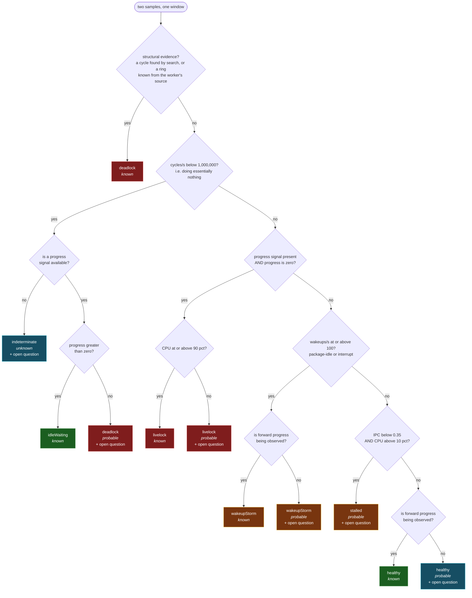
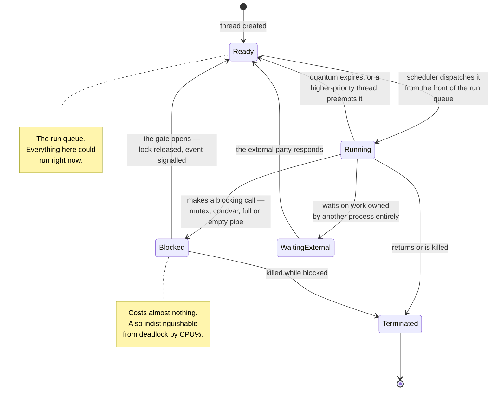

# The energy lab

## The finding

A process that has deadlocked and a process that is healthily asleep look
identical in every tool most people reach for. Both sit at 0% CPU. Both are
green in Activity Monitor. Neither is scheduled, neither burns cycles, neither
raises an alert.

One of them will wake up when its event arrives. The other will never run
again.

This is not a subtle measurement problem. It is the direct consequence of what
CPU percentage *is*: the fraction of a window during which the kernel had this
thread on a core. A blocked thread is off-core by definition, so the number is
zero, and it is zero for the same reason in both cases. The metric is doing its
job correctly. It simply does not carry the information anyone actually wants.

The energy lab is the argument that a richer signature does carry it. Six
worker processes are given the *same nominal job* — complete one unit of work
roughly every 200 milliseconds — and differ only in how that work is
coordinated. Everything below is a difference in coordination, never a
difference in workload.

### Measured on this machine

A 2019 16-inch MacBook Pro (Intel Core i7-9750H), six workers, one 3-second
window each. All six predictions held.

| scenario | cycles/s | IPC | CPU% | wakeups/s | progress/s | verdict | confidence |
| --- | ---: | ---: | ---: | ---: | ---: | --- | --- |
| `healthy` | 328,556 | 0.24 | 0.02 | 4.7 | 4.66 | `idleWaiting` | known |
| `wakeup-storm` | 22,826,936 | 0.22 | 1.23 | 814.9 | 4.00 | `wakeupStorm` | known |
| `livelock` | 3,836,481,384 | 1.25 | 99.12 | 0.0 | 0.00 | `livelock` | known |
| `deadlock` | 0 | 0.00 | 0.00 | 0.0 | 0.00 | `deadlock` | known |
| `pipe-deadlock` | 0 | 0.00 | 0.00 | 0.0 | 0.00 | `deadlock` | probable |
| `stalled` | 2,362,712,031 | 0.06 | 99.04 | 0.0 | 5.00 | `stalled` | probable |

Read the CPU% column alone and the story is: four processes are fine, two are
busy. Read the whole row and the story is completely different.

Look at the first and fourth rows. **0.02% versus 0.00%.** Two hundredths of a
percentage point separate a worker that is quietly completing four to five units
of work a second from a worker that has taken two mutexes in the wrong order and
will never complete anything again. No threshold on that column can be drawn.
There is nothing there to threshold.

Now look at rows three and six. Both are pinned at essentially one full core:
99.12% and 99.04%. Indistinguishable by CPU. Their instructions-per-cycle differ
by roughly twenty times — 1.25 against 0.06 — because one is spinning through a
tight loop at full pipeline throughput while the other is chasing pointers
through 64 MB and spends nearly every cycle waiting on memory. Same CPU reading,
opposite problems, opposite fixes.

And row two is the one that survives code review. Work arrives at it at exactly
the rate it arrives at row one; the only difference between them is that one
waits to be told and the other asks a thousand times a second. 1.23% CPU is
*nothing*. It would never be flagged. But 814.9 wakeups per second is the sound
of a CPU
package being dragged out of its deep idle states eight hundred times a second,
in exchange for the same nominal five units of work per second as the row above
it — 4.00 measured against 4.66 — which cost 328,556 cycles. Relative to that
blocking baseline this is roughly a hundredfold difference in cycles for the
same output. The lab prints the same fact per unit: the storm spends **203.9
wakeups for every unit of work completed**, where the blocking worker spends
about one.

> The cycle ratios in this document are order-of-magnitude claims only. A
> near-idle baseline varies substantially between runs on a loaded machine, so
> `roughly 100x` is the strongest form the measurement supports and the CLI
> deliberately refuses to print anything more precise.

---

## What the lab measures, and what it does not

The lab reads `proc_pid_rusage` with `RUSAGE_INFO_V6` and takes two samples a
window apart. The counters it uses are cumulative and monotonic; it derives
rates from the difference.

| Counter | What it tells you |
| --- | --- |
| `ri_cycles` | Cycles the hardware actually spent on this process. |
| `ri_instructions` | Instructions retired. Divided by cycles, this is IPC. |
| `ri_user_time` + `ri_system_time` | Where CPU percentage comes from. |
| `ri_interrupt_wkups` | Wakeups caused by an interrupt arriving. |
| `ri_pkg_idle_wkups` | Wakeups that pulled the whole package out of idle. |

**The lab does not measure joules, and never claims to.** The `billed_energy`
fields in the same struct read 0 on this Intel Mac, so there is no vendor energy
figure to report and none is invented. What the lab uses instead is a proxy:
cycles consumed, and wakeups that deny the package its low-power states. That
proxy is defensible — both quantities cost real energy — but it is not a
calibrated conversion. Frequency and voltage scaling mean a cycle at one
operating point does not cost the same as a cycle at another, and the lab has
no visibility into which point the core was at. Treat every number here as a
*signature*, which is what it is called, and not as a power measurement.

One counter is not from the kernel at all. Each worker publishes a **forward
progress heartbeat** into an 8-byte `mmap`'d slot, incremented once per
completed unit of work. That store costs approximately nothing — an earlier
version of the worker rewrote a file per unit and inflated the healthy baseline
by two orders of magnitude, which is a nice demonstration that the instrument
can become the experiment.

That heartbeat is the whole difference between the first and fourth rows of the
table. Cycles cannot separate them. Progress can, instantly and unambiguously.

---

## The classifier

`PathologyClassifier.classify` is deliberately small enough to read in one
sitting, and the diagram below is that function branch for branch.



Four things about that tree are worth stating out loud.

**The `indeterminate` leaf is the honest centre of the design.** When cycles are
near zero and there is no progress signal, the counters genuinely cannot choose
between a deadlocked process and a healthy blocked one. The lab does not guess.
It returns `indeterminate` at `unknown` confidence and attaches the question
that would resolve it: *does this process make forward progress?* An unknown
becomes an inquiry, never a blank.

**Two of the leaves are split by the same question.** Both `healthy` and
`wakeupStorm` are `known` only when a progress signal exists and is advancing.
Without one they drop to `probable` and carry an inquiry, because each is a
claim the counters cannot actually support on their own. "Energy is becoming
progress" is a statement *about progress*; from cycles alone, a busy loop that
achieves nothing looks exactly like useful work. And a wakeup rate cannot
separate wasteful polling from genuinely event-driven work at a high event rate
— only counting wakeups against units of work can, which is the number the
`wakeup-storm` row reports as 203.9 wakeups per unit.

The `healthy / probable` path is not an edge case. It is the most common
real-world path in the whole tree, because `mac-health energy watch <pid>`
pointed at any third-party process has no heartbeat to read. The lab still names
what it sees, and still says out loud that it is inferring from cost alone.

**Order matters, and it encodes a claim.** The livelock test runs before the
wakeup and IPC tests because "burning cycles and producing nothing" is a
stronger statement than either of the others, and because the wakeup-storm
worker *does* make progress and must not be misread as a livelock. Note also
that the livelock branch is only reachable when a progress signal exists — a
busy process with no heartbeat falls through to the wakeup and IPC tests, which
is the correct behaviour for `energy watch` on an arbitrary pid.

**The thresholds are stated, not hidden.** They are public constants:

| Constant | Value | Reasoning |
| --- | ---: | --- |
| `quiescentCyclesPerSecond` | 1,000,000 | Below this a modern core has done nothing meaningful in a second. |
| `wakeupStormPerSecond` | 100 | Sustained wakeups above this deny the package its deep idle states. |
| `stalledIPC` | 0.35 | Well under one retired instruction per cycle on a superscalar core is *consistent with* a pipeline waiting on memory rather than executing. Only consistent with: cache misses, false sharing and lock contention all produce the same reading, which is why this branch never returns better than `probable`. |
| `saturatedCPUPercent` | 90 | Roughly one core fully occupied. |

They are judgement calls informed by the measurements above, not physical
constants, and the code says so in as many words, in the comment directly above
the four constants:

> These four are round numbers chosen by hand, informed by the measurements in
> docs/energy-lab.md and not derived from first principles. Each one decides
> what the lab is willing to name, so changing one changes the verdicts — they
> are policy, not physics.

---

## The states a thread can be in

The classifier's vocabulary is not arbitrary. It is a description of where a
thread sits relative to the scheduler.



This is the classical scheduler model, and it is the level at which the lab
reasons. XNU's actual internal thread states are more detailed than five boxes
— it distinguishes several flavours of wait and has its own run-queue
structure — and this document does not attempt to describe them precisely. The
five-state model is sufficient for the argument and is not being presented as
a faithful account of kernel internals.

The mapping to the lab's vocabulary is direct:

- `healthy` — mostly **Running**, converting cycles into progress.
- `idleWaiting` — mostly **Blocked**, and the gate keeps opening.
- `deadlock` — **Blocked**, and the gate will never open.
- `livelock` — permanently **Ready/Running**, and none of it becomes progress.
- `wakeupStorm` — oscillating between **Blocked** and **Ready** hundreds of
  times a second when it could have blocked once.
- `stalled` — **Running**, but the core is waiting on memory rather than
  retiring instructions.

Notice that `deadlock` and `idleWaiting` occupy the *same box*. That is the
finding, restated structurally.

---

## The shape of a deadlock

A deadlock is not a state a thread is in. It is a property of the graph formed
by all the threads at once.

Draw one arrow per blocked thread, pointing from the waiter to whoever holds
the thing it is waiting for. The `deadlock` scenario produces exactly this:


The ring is closed. Every actor in it is waiting on the next, so no release can
ever originate anywhere inside it, and nothing outside it will ever release
anything on its behalf. This is not a probabilistic statement or a timeout
heuristic — the structure itself proves that forward progress is impossible.

Compare that with a chain that merely looks alarming:


Two blocked threads, zero CPU, no cycle. This is `blockedButLive` — the
methodology's *waiting on external process*. It may be slow, it may need a
timeout, but it is not broken, and calling it a deadlock would be a false
alarm. `WaitForGraph.deadlocks()` runs a three-colour depth-first search and
reports only closed rings, each keyed by its canonical rotation so the same
cycle found from two entry points is reported once.

The same structure gives you the opposite question for free.
`WaitForGraph.frontier(among:)` returns the actors that wait on nothing: the
run queue. Everything the machine could do *right now*.

---

## Confidence

Six diagnoses in the table above; four say `known` and two say `probable`. That
difference is load-bearing.

From the methodology this lab is built on:

> Confidence is not decoration. It determines how strongly the system may
> present a claim and whether it is allowed to control execution.

The code enforces exactly that. `Confidence` is a four-valued ordered enum —
`unknown` → `possible` → `probable` → `known` — and it exposes one property:

```swift
public var mayDriveAction: Bool { self == .known }
```

Anything below `known` may be displayed, explained, and argued about. It may
not trigger an automatic action. A tool that kills processes on a `probable`
deadlock will eventually kill a healthy one.

The discipline reaches into the wording, too. `Pathology.headline` takes the
confidence as an argument — `headline(at: d.confidence)` — because some of these
sentences name a *structure* that only a settled verdict has any right to
assert. At `known`, `deadlock` reads *"Frozen: a cycle in the wait-for graph."*
Below `known` the same pathology reads *"Silent: consuming no CPU and completing
no work"*: a description of the reading rather than the conclusion. Otherwise
the confidence label ends up arguing with the sentence printed next to it, and
it is the sentence that lands.

### Three kinds of structural evidence

Structural knowledge outranks every inference from counters, because it says
forward progress is *impossible* rather than merely absent. But "structural
knowledge" is not one thing, and the difference between its kinds is exactly the
kind of distinction this document is about. `StructuralEvidence` has three
cases:

| Case | What it means | What the lab may say |
| --- | --- | --- |
| `.none` | Counters only. | Whatever the tree infers, at the confidence the tree allows. |
| `.knownByConstruction(mode:)` | The lab launched this worker itself, in a mode whose wait-for ring is visible in its source. | `deadlock`, `known` — but the evidence line says where the knowledge came from. |
| `.cycleFound(DeadlockCycle)` | A cycle was actually found by searching a wait-for graph. | `deadlock`, `known`, and this is the only case allowed to claim a search happened. |

That middle case exists because of a bug in an earlier version of this lab. The
`deadlock` verdict used to print *"a cycle was found in the wait-for graph"* at
`known` confidence — and no graph had been searched. The lab had compared the
scenario's **name**. The verdict was right and the evidence was fiction, which
is the worse of the two failures: a reader who checks the evidence line is
exactly the reader you must not mislead.

So the `deadlock` scenario now reports what is actually true of it:

> the worker was launched in 'deadlock' mode, whose wait-for ring is visible in
> its source
>
> the ring is known from that source, not harvested from live wait edges

A construction is not an observation. Both can support `known`; only one of them
may describe a search.

### Why `pipe-deadlock` is only *probable*

Rows four and five of the measurement table are numerically identical: 0 cycles,
0.00 IPC, 0.00% CPU, 0 wakeups. They get different confidence for a reason that
has nothing to do with the counters.

For the `deadlock` scenario the lab **knows the structure by construction**. The
worker was launched with a mode that takes two mutexes in opposite orders; the
ring in the diagram above is a fact about the program, not an inference from a
reading. So the classifier is handed `.knownByConstruction(mode: "deadlock")`,
and that outranks everything else in the tree.

For `pipe-deadlock` the lab has only the counters. Zero cycles and zero
progress over the window is *consistent with* a deadlock, and it is the best
available explanation — which is precisely what `probable` means. But it is also
consistent with a process blocked on something slow that simply did not arrive
within three seconds. The lab says `probable` and attaches the inquiry:

> Confirm by sampling the wait edges: a proven cycle in the wait-for graph
> raises this from probable to known.

That is the general rule for raising confidence here. **Counters infer;
structure proves.** Evidence that would promote a claim:

| From | To | What it would take |
| --- | --- | --- |
| `indeterminate` / unknown | `idleWaiting` or `deadlock` | Any forward-progress signal at all: a heartbeat, a log line, a completed request counter. |
| `healthy` / probable | `healthy` / known | Any forward-progress signal. Cost alone cannot tell a useful workload from an expensive one that achieves nothing. |
| `wakeupStorm` / probable | `wakeupStorm` / known | Units of work to divide the wakeups by. A high wakeup rate is only wasteful relative to what it collects. |
| `deadlock` / probable | `deadlock` / known | The actual wait edges — which thread holds what, and what each is blocked on — showing a closed ring, i.e. `.cycleFound` rather than `.none`. |
| `livelock` / probable | `livelock` / known | CPU at or above saturation, or a wider window ruling out a merely slow producer. |
| `stalled` / probable | `stalled` / known | A memory-hierarchy profile. Low IPC is equally consistent with cache misses, false sharing, and lock contention, and the lab cannot tell which. |

`stalled` stays at `probable` permanently in this tool, because the tool does
not have a hardware profiler and will not pretend otherwise. The system does not
manufacture domain truth.

---

## The six scenarios

Each worker is a real process, wrong in exactly one named way, doing the same
nominal job as all the others.

### `healthy` — Blocking wait

**Teaches:** a thread that blocks until an event arrives costs the machine almost
nothing. The consumer thread genuinely blocks on a condition variable, so the
scheduler takes it off the run queue entirely and the package is free to enter a
deep idle state until something signals it. The event comes from a separate
timer thread standing in for the hardware a real program would wait on, so the
process still wakes about five times a second — **that arrival rate, not the
waiting, is what its cost is made of.**

**Measured:** 328,556 cycles/s · IPC 0.24 · 0.02% CPU · 4.7 wakeups/s · 4.66
work units/s → `idleWaiting`, known.

The verdict is `idleWaiting` rather than `healthy` and that is correct: for
almost the whole window this process is asleep. It is doing its job perfectly.

This is also what makes the comparison with the next scenario fair. Both workers
receive work at the same rate. One waits to be told; the other asks a thousand
times a second. Everything between them is the cost of that difference and
nothing else.

**Remedy:** nothing to fix. This is the shape every other scenario should be
turned into.

### `wakeup-storm` — Polling instead of waiting

**Teaches:** timer-driven polling produces the same output as a blocking wait at
a wildly different cost. This worker receives work at exactly the same rate as
the blocking one, but asks for it a thousand times a second instead of waiting to
be told. Each wakeup drags the package out of idle before it has recouped the
cost of entering. CPU percentage barely moves, which is why this pathology
survives code review.

**Measured:** 22,826,936 cycles/s · IPC 0.22 · 1.23% CPU · 814.9 wakeups/s ·
4.00 work units/s → `wakeupStorm`, known.

The worker polls at 1 kHz for work that arrives at 5 Hz. The same output as
`healthy`, roughly a hundred times the cycles, and **203.9 wakeups spent per unit
of work** where about one would have done. On a laptop this is battery life
converted directly into nothing.

Note that the verdict here is `known` only because the lab can see the work units
in the denominator. Pointed at a process with no heartbeat, the same wakeup rate
returns `probable` and asks whether the rate is intentional — a busy event-driven
service really can be woken eight hundred times a second by eight hundred events.

**Remedy:** wait on the event, not on the clock — a condition variable, kqueue,
or dispatch source. If you must poll, coalesce timers and widen the interval.

### `livelock` — Spinning on a condition

**Teaches:** a spin loop keeps the thread on the run queue and the core at full
clock. It is the most expensive state a machine can occupy, and from the outside
it looks like hard work.

**Measured:** 3,836,481,384 cycles/s · IPC 1.25 · 99.12% CPU · 0.0 wakeups/s ·
0.00 work units/s → `livelock`, known.

IPC of 1.25 means the pipeline is genuinely humming. Nearly four billion cycles
a second, retiring more than one instruction each, and the progress counter never
moves. More than a thousand times the cycles of the blocking baseline, for zero
units of work. This is the pathology that a CPU graph flatters.

**Remedy:** block instead of spinning. Spin only for the few hundred
nanoseconds where a context switch would genuinely cost more, and always with a
bounded backoff.

### `deadlock` — Lock-order inversion

**Teaches:** two threads take two mutexes in opposite orders. The wait-for graph
closes into a cycle and no amount of waiting can ever open it. The counters go
silent — the same silence as a healthy idle process.

**Measured:** 0 cycles/s · IPC 0.00 · 0.00% CPU · 0.0 wakeups/s · 0.00 work
units/s → `deadlock`, known.

Zero. Not "low" — zero. This process is the cheapest thing on the machine and
it is completely broken. Compare it with the `healthy` row and the entire
argument for this lab is contained in the gap between 0.00 and 0.02.

The `known` here is earned by construction, not by search: the lab started this
worker in a mode whose ring is written out in `Sources/ChaosWorker/main.c`, and
the evidence line says exactly that.

**Remedy:** impose a global lock order and take locks in that order everywhere,
or take both under a single higher-level lock.

### `pipe-deadlock` — Backpressure deadlock

**Teaches:** no mutex is involved. The pipe buffer is the gate. The parent waits
for the child to exit before draining, so once the child has written past the
buffer capacity it blocks on `write` while the parent blocks in `waitpid`.

**Measured:** 0 cycles/s · IPC 0.00 · 0.00% CPU · 0.0 wakeups/s · 0.00 work
units/s → `deadlock`, probable.


The same closed ring as the lock-order case, built entirely out of a full pipe
buffer. **This exact defect shipped in this repository's own shell layer.** It is
in the lab because it is the failure the authors actually made, not a
hypothetical.

**Remedy:** drain the pipe before reaping the child, or read on another thread.
Never make a producer's completion a prerequisite for consuming what it
produced.

### `stalled` — Memory-bound work

**Teaches:** progress continues, but each unit costs far more than it should.
The core is at full clock while the pipeline waits on memory, so IPC collapses
even though CPU percentage is high.

**Measured:** 2,362,712,031 cycles/s · IPC 0.06 · 99.04% CPU · 0.0 wakeups/s ·
5.00 work units/s → `stalled`, probable.

The worker chases pointers through a 64 MB buffer, far larger than any cache, so
nearly every access misses. IPC of 0.06 means well under one instruction retired
every ten cycles. Set this row beside the `livelock` row: 99.04% against 99.12%
CPU, and roughly twenty times the IPC. CPU percentage says they are the same.
They have nothing in common.

Note also that this row is still *completing work* — five units a second, the
same nominal rate as every other worker. That is what separates `stalled` from
`livelock`, and why the classifier reaches this branch at all.

**Remedy:** improve locality — shrink the working set, traverse contiguously,
and separate data that different threads write so they do not share cache lines.

---

## Using it

### `mac-health energy scenarios`

Lists all six scenarios with what each teaches, the pathology it predicts, and
its remedy. Runs nothing and measures nothing.

### `mac-health energy lab [id]`

Runs every scenario, or one named scenario, as a real child process. Each run
launches the worker, waits 400 ms for it to reach steady state so that startup
is not measured instead of behaviour, samples, waits a 3-second window, samples
again, and classifies. The child is killed afterwards.

```bash
mac-health energy lab              # all six
mac-health energy lab deadlock     # just the lock-order inversion
```

Output per scenario: the verdict and its headline, the confidence, the raw
evidence lines, and any open question. It also prints whether the **prediction
held** — every scenario declares its expected pathology before the run, and a
prediction that cannot fail teaches nothing. The summary table at the end holds
the counter columns of the table at the top of this document — cycles, IPC, CPU
and wakeups — plus order-of-magnitude cycle ratios against the blocking
baseline. Progress per second appears in each scenario's evidence lines rather
than in that table.

| Exit code | Meaning |
| ---: | --- |
| `0` | Every prediction held. |
| `1` | At least one scenario did not behave as predicted. |
| `64` | No scenario by that name. |
| `70` | `chaos-worker` is not next to the binary. Build it first. |

The `deadlock` scenario is the one case where the lab does better than infer,
because it launched the worker and the wait-for structure is visible in that
worker's source. That is knowledge by construction, and the evidence line says
so rather than claiming a graph was searched. Everything else is judged from
counters alone.

### `mac-health energy watch <pid>`

Points the same classifier at a process you already have.

```bash
mac-health energy watch 4242
```

Two samples, two seconds apart, then a verdict with its evidence. Be aware of
one honest limitation: an arbitrary pid has **no progress heartbeat**, and that
limitation reaches every leaf of the tree. A quiescent process lands on
`indeterminate` at `unknown` confidence with the open question attached. A busy
one with no visible pathology lands on `healthy` at `probable`, saying plainly
that "healthy" is an inference from cost alone. A process waking a thousand
times a second lands on `wakeupStorm` at `probable`, asking whether that rate is
intentional. None of that is the tool failing. That is the tool declining to
guess about the exact case it was built to be honest about.

| Exit code | Meaning |
| ---: | --- |
| `0` | A verdict was produced. |
| `64` | No pid given. |
| `70` | The pid could not be read — it exited, or you lack permission. |

---

## Limits, stated plainly

- **No joules.** `billed_energy` reads 0 on this Intel Mac. Cycles and wakeups
  are an energy *proxy*, not a power measurement, and frequency and voltage
  scaling mean the proxy is not linear in energy.
- **Three seconds is short.** A slow producer can look like a livelock over one
  short window, which is exactly why the unsaturated livelock branch returns
  `probable` and asks for a wider window.
- **A loaded machine is noisy.** These numbers were taken on a working laptop,
  not an isolated bench. The near-idle baseline is the most variable figure in
  the table, which is why every ratio is stated to an order of magnitude.
- **Ratios are order-of-magnitude only.** "Roughly 100x" and "more than 1000x"
  are the strongest claims the method supports.
- **Process granularity.** `proc_pid_rusage` reports per-process totals. A
  four-thread process where one thread deadlocks and three work normally will
  not look quiescent. The lab sees the process, not the thread.
- **The wait-for graph is not yet populated from a live system.** It is exercised
  by its unit tests, and the `deadlock` scenario's ring is known by construction
  rather than harvested. Collecting real wait edges from arbitrary running
  processes is a separate and much harder problem, and nothing here claims to
  have solved it.
- **Thresholds are judgement calls.** 1,000,000 cycles/s, 100 wakeups/s, IPC
  0.35 and 90% CPU are informed by the measurements above and by how these
  counters behave on this hardware. They are not derived from first principles.
- **Progress is the signal the lab usually will not have.** Every `known`
  verdict in the table except `deadlock` rests on a heartbeat the lab could read
  because it built the worker. Pointed at software it did not write, the
  strongest honest verdicts available are `probable` and `unknown`, and that is
  the normal case rather than the degraded one.
- **The `healthy` worker's five wakeups a second come from a timer thread.** It
  is standing in for hardware — a device interrupt, a socket becoming readable
  — that a real program would be waiting on. The blocking is real; the event
  source is a simulation, and the baseline's cost is set by the arrival rate that
  simulation chose.

---

## Source

| File | Contains |
| --- | --- |
| `Sources/EnergyLab/EnergySample.swift` | Counter reads and the rate signature. |
| `Sources/EnergyLab/Pathology.swift` | The taxonomy and the classifier in the diagram above. |
| `Sources/EnergyLab/Confidence.swift` | The four-valued confidence scale and `mayDriveAction`. |
| `Sources/EnergyLab/WaitForGraph.swift` | Wait edges, cycle detection, the frontier. |
| `Sources/EnergyLab/ChaosLab.swift` | The six scenarios and the measurement harness. |
| `Sources/ChaosWorker/main.c` | The workers themselves, one mode each. |
| `Sources/MacHealthCLI/EnergyCommand.swift` | The terminal face. |

The conceptual companion to this document is
[docs/os-as-distributed-system.md](os-as-distributed-system.md), which argues
why the wait-for graph and a strategy dependency graph are the same object.
