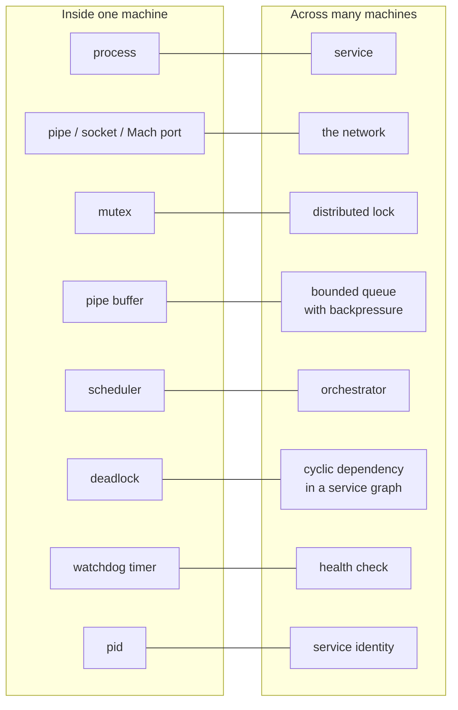
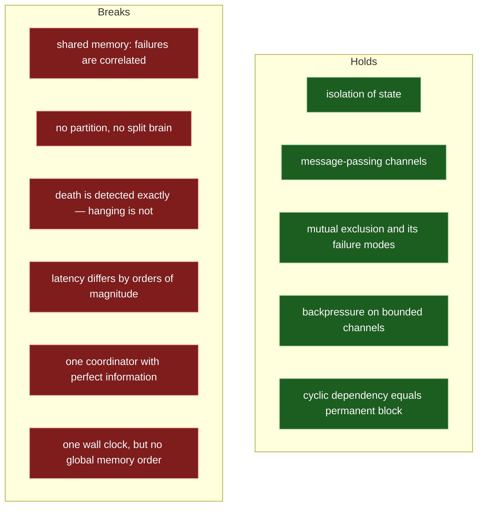
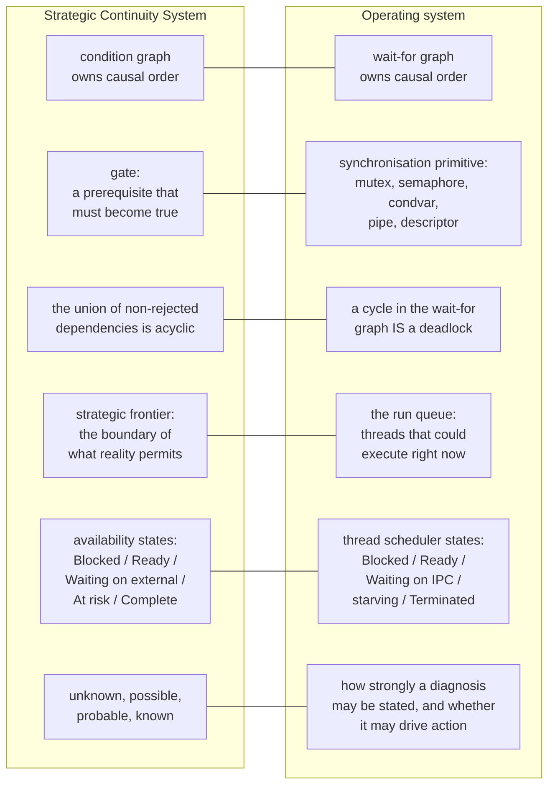
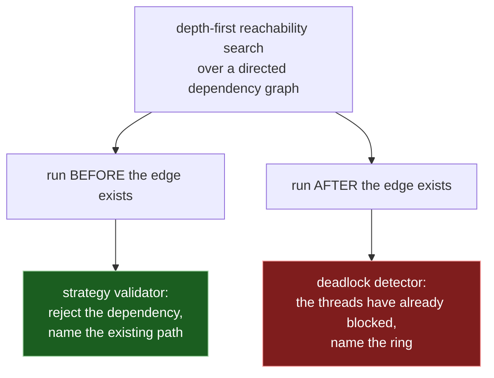

# Your Mac is a distributed system

## The claim

Open Activity Monitor and you are looking at a few hundred independent programs,
written by different people in different decades, holding state the others
cannot see, coordinating over channels that can fill up and block, competing for
resources none of them owns, and negotiating with a central authority that
decides who runs and when.

That is a distributed system. It happens to fit under a keyboard.

This document argues the correspondence carefully, spends equal effort on where
it **breaks**, and then connects both to the Strategic Continuity System — the
methodology the energy lab is built on — where the same graph turns out to be
doing the same job in a completely different domain.

The measurements that motivate all of this are in
[docs/energy-lab.md](energy-lab.md).

---

## The mapping

Each of these is worth more than a line.

### A process is a service

It owns private state — its address space — that no peer may read directly. It
exposes a defined interface: the file descriptors it accepts, the ports it
registers, the signals it handles. It can be started, stopped, upgraded, and
restarted independently of its peers. It has an identity that others address it
by. It fails on its own without necessarily taking its neighbours down.

Every property people mean by "microservice" is already true of a Unix process,
about forty years earlier.

### IPC is the network

A pipe, a socket, a Mach port: bytes leave one isolation boundary and arrive at
another, with no shared state along the way. The channel has finite capacity.
It can block the sender. It can be closed at either end. The receiver learns
about closure asynchronously, as a condition on a read rather than a call
returning. Messages can arrive interleaved with other work.

You cannot reach into another process to fix its state, exactly as you cannot
reach into another machine. You send a message and hope.

### A mutex is a distributed lock

Both are agreements about mutual exclusion enforced by a party outside the
contenders. Both grant ownership to exactly one holder at a time. Both have the
same failure modes in the same order: forgetting to release, taking two in
inconsistent orders, holding one across an operation whose duration you do not
control.

The advice given to distributed systems engineers — impose a global lock
ordering, keep critical sections short, never hold a lock across a call to
something you do not own — is verbatim the advice in every threading textbook.
It is the same advice because it is the same problem.

### A pipe is a bounded queue with backpressure

This one is the most exact correspondence in the list. A pipe has a fixed buffer
(around 64 KB on macOS, as the lab's worker exploits). When the buffer fills,
`write` blocks. That is backpressure, implemented in the kernel, doing precisely
what a bounded queue in front of an overloaded consumer does: refusing to let
the producer run ahead of the consumer indefinitely.

And it fails in precisely the same way when someone mishandles it. The lab's
`pipe-deadlock` scenario is a parent that waits for its child to exit before
draining the pipe. The child fills the buffer, blocks on `write`, and can
therefore never exit; the parent waits forever for an exit that its own
behaviour has made impossible.

Any distributed systems engineer would recognise this instantly as a consumer
that will not consume until the producer is finished. **This exact defect
shipped in this repository's own shell layer.** The general rule is the same at
both scales: never make a producer's completion a prerequisite for consuming
what it produced.

### The scheduler is the orchestrator

It admits work, assigns it to execution resources, preempts it, enforces
priorities and quality-of-service classes, and decides what happens when demand
exceeds supply. Give it a different vocabulary — nodes instead of cores, pods
instead of threads, quotas instead of quanta — and you have a cluster scheduler.

The run queue is the admission decision made concrete: the set of work that
could proceed right now if there were a core free for it.

### A deadlock is a cyclic dependency in a service graph

Service A cannot finish until B answers. B cannot finish until A answers. No
timeout, no retry, no restart of either one individually resolves it, because
the defect is not in A or in B but in the *shape* of the graph they form
together.

Draw one arrow per blocked party, from the waiter to the holder, and a deadlock
is exactly a closed ring:

Nothing in that diagram is specific to mutexes, to threads, or to a single
machine. It is a statement about a directed graph.

---

## Where the analogy breaks

An analogy that only flatters itself is worthless. Here is where this one stops
holding, and some of these differences are large enough to reverse the
engineering conclusions you would draw from it.

### Failure is not independent

This is the deepest break. Distributed systems earn their complexity from an
assumption that participants fail independently: that is the entire reason
replication buys you anything.

Inside one machine that assumption is simply false. The processes share
physical memory, a page cache, a kernel, a power supply, and a thermal budget.
A kernel panic terminates every "service" at once. Memory pressure degrades all
of them together. On the machine this project was written for, a GPU fault
storm stalls `WindowServer` and the kernel's watchdog then panics the entire
system — one component's failure taking down everything, which is exactly the
correlated failure a distributed system is designed to survive and a single
machine is not.

Replicating a process on the same machine does not buy you availability. It
buys you two copies of something that will die at the same instant.

### There is no partition, and no split brain

The canonical distributed systems nightmare is the network partition: two halves
of a cluster that can each still serve requests, cannot see each other, and each
conclude the other is dead. Everything hard about consensus exists to cope with
that.

It cannot happen inside one machine. There is exactly one kernel, and it is
either running or the machine is off. Two processes cannot disagree about which
of them holds a mutex. No quorum protocol is required, because there is no
question a quorum would answer. Every mechanism in the distributed systems
canon aimed at partitions — Paxos, Raft, quorum reads, CRDTs — solves a problem
that has no local analogue.

(Vector clocks are sometimes listed alongside those, and they do not belong
there. They are causal-ordering machinery, not partition tolerance, and ordering
*does* have a local counterpart — see below.)

### Death is detected exactly; hanging is not

In a distributed system you fundamentally cannot distinguish "the peer is dead"
from "the peer is slow" from "the reply is lost". Every failure detector is a
timeout, and every timeout is a guess with a false-positive rate.

For **death**, locally, the kernel *knows*. A process that dies produces
`SIGCHLD`, closes its descriptors, and delivers EOF to everyone reading from it.
`waitpid` returns a real exit status, not an inference. Reaping is
authoritative.

This is not a small convenience. It removes the entire category of problems that
timeouts create — spurious failovers, duplicated work, split-brain writes — and
it is why local error handling can be written as straight-line code where
distributed error handling cannot.

But **hanging** is a different question, and the break in the analogy is much
smaller than it first appears. Consider the case the lab is built around: two
threads in one process, each holding a mutex the other wants. The kernel can see
that both threads are parked in a wait — a `ulock`/`psynch` wait, on this
platform — and it knows they are not runnable. What it does not maintain is an
ownership graph over user-space locks. An uncontended `pthread_mutex_t` is a word
in the process's own memory that the kernel is never asked about at all; it only
becomes involved when a thread has to block. There is no supported interface that
will answer "thread T holds lock L, and thread U is waiting on it" for an
arbitrary process, and so far as we have been able to establish, XNU keeps no
queryable global wait-for graph from which such an answer could be assembled.

So the exactness available locally is exactness about *death*, and about the fact
that a thread is parked. It is not exactness about the ring. Detecting a local
hang is very nearly as hard as detecting a remote one, for a reason that is
structurally the same: the information that would settle it is held by the
participants, not by the observer. This is precisely why the lab returns
`indeterminate` at `unknown` confidence when it is pointed at a pid it did not
spawn and finds it quiescent — and why the fix it asks for is a heartbeat rather
than a cleverer kernel query.

### Latency differs by orders of magnitude

A mutex acquisition on an uncontended lock is a matter of nanoseconds. A context
switch is measured in microseconds. A network round trip between machines is
typically hundreds of microseconds at best and frequently milliseconds. (These
are conventional orders of magnitude, not figures this project measured — the
only numbers this repository has measured are in the energy lab document.)

Several orders of magnitude change what is worth doing, not merely how fast it
happens:

- Batching, which is essential across a network, is often pure overhead locally.
- Caching a remote result is almost always worth it; caching a local one may
  cost more in invalidation than it saves.
- Retrying a remote call is standard practice; retrying a local lock acquisition
  in a tight loop is the `livelock` scenario, and it is the most expensive state
  a machine can occupy.

The lab measures that last one directly. Spinning instead of blocking burned
more than a thousand times the cycles of the blocking baseline while completing
zero units of work. The distributed instinct — keep asking until it answers — is
actively harmful at local latencies.

### One coordinator has perfect information

The kernel knows every thread, every wait, every open descriptor, every page
mapping, and every priority, all at once and consistently. No distributed system
has anything remotely like this. Cluster orchestrators work from a state store
that is always slightly stale and possibly wrong, and much of their design
exists to reconcile intent with a reality they can only observe indirectly.

The kernel does not observe. It *is* the state.

This makes the OS both a stronger system and a weaker analogy. Stronger, because
consistent global knowledge is exactly what distributed systems sacrifice most
to approximate. Weaker, because any argument of the form "the OS solves this, so
your cluster can too" quietly assumes a coordinator with perfect information
that your cluster does not have.

### One wall clock — but no global order over memory

Processes on one machine share a monotonic clock. Timestamping two events and
asking which came first is a comparison, not a protocol. Across machines, clocks
drift, and much of the apparatus of logical clocks exists to construct an
ordering that physical time cannot supply.

That is true of wall-clock time and false of memory. Two threads running on
different cores have **no total order over their memory operations**. Each core
has its own store buffer and its own view of the cache hierarchy; writes become
visible to other cores at different times and, without explicit constraints, in
different orders. There is no global "now" for memory even inside one chip.

This is not an obscure corner — it is why the C11/C++11 memory model exists at
all, why atomics carry `acquire`/`release`/`seq_cst` annotations, why barrier
instructions exist, and why `pthread_mutex_lock` and `pthread_mutex_unlock` are
specified to carry ordering semantics and not merely mutual exclusion. Locking is
how a program *constructs* a happens-before relation locally, exactly as a
distributed system constructs one across nodes.

So the correspondence here is stronger than "one clock" suggests, and it is where
vector clocks actually belong: happens-before is a local problem too, and
acquire/release is its local solution. What differs is the cost and the
mechanism, not the existence of the problem. A distributed system builds causal
order out of messages and metadata; a multicore machine builds it out of
instructions the hardware honours in tens of nanoseconds. The single machine
still had to build it.

### What survives

The correspondence is strongest for **coordination structure** — who waits for
whom, who holds what, how work is admitted, where backpressure lives — and for
**causal ordering**, where the local version is real machinery rather than a
free gift of the hardware. It is weakest for **failure semantics**:
independence, partition, consensus, and the detection of anything short of
death.

Which is convenient, because coordination structure is exactly what the energy
lab reasons about.

---

## The same graph, twice

The energy lab is built on a methodology written for something entirely
different: planning long-running human work under uncertainty, the *Strategic
Continuity System*. It was not designed as an operating systems model. The
correspondence was discovered, not engineered, which is why it is worth stating
carefully.

The mapping is not a metaphor laid over the code. It is the code.

### Time is derived, not primary

The methodology's first structural claim is that a graph of conditions owns
causal order, and that time is a projection of it. Schedules are computed from
dependencies rather than dependencies being fitted into schedules.

This is what a scheduler does. There is no timeline anywhere in a kernel. There
is a set of runnable threads and a set of blocked ones, and the order in which
things happen falls out of which conditions become true. A Gantt chart of a
running system is something you draw afterwards, in exactly the same way the
methodology says a plan's dates are drawn afterwards.

### Gates are synchronisation primitives

The methodology's gates prevent downstream work from appearing possible before
its prerequisites are satisfied. That sentence is a definition of a mutex, and
of a semaphore, and of a condition variable, and of a full pipe buffer.

`Gate` in `Sources/EnergyLab/WaitForGraph.swift` enumerates them: `.mutex`,
`.semaphore`, `.conditionVariable`, `.pipe`, `.fileDescriptor`,
`.externalProcess`. That last one is the methodology's own term, kept
deliberately, because it means the same thing in both domains: work controlled
outside this boundary entirely, never the waiter's fault and never something the
waiter can resolve alone.

### Cycle rejection and deadlock detection are one algorithm

The methodology's central invariant is that the union of all non-rejected
dependencies stays acyclic, and that a proposed edge which would close a cycle
must be **rejected with the existing path identified**. Not merely refused —
explained, by naming the path that already exists.

An operating system runs the identical reachability check. The only difference
is *when*:

A planner can refuse the edge, because the dependency is a proposal. A kernel
cannot, because by the time the edge exists the thread has already called
`pthread_mutex_lock` and stopped. **A strategy validator run forwards is a
deadlock detector run backwards.** Same depth-first search, same closed ring,
same requirement to name the path rather than merely announce a failure —
`DeadlockCycle.describe()` prints `T1 —(mutex A)→ T2 —(mutex B)→ T1` for exactly
that reason.

The comment saying so is in the source, above `WaitForGraph`.

### The run queue is the strategic frontier

The methodology defines the strategic frontier as "the exact boundary between
what reality currently permits and what it does not yet permit". It is the most
operationally useful object in the system: not everything you want, and not
everything blocked, but precisely the set of things that could begin now.

`WaitForGraph.frontier(among:)` computes it by removing every actor that appears
as a waiter. What remains is the set of actors blocked on nothing.

That is the run queue. Same definition, same computation, same purpose.

### Availability states are scheduler states

The methodology's derived availability states — Blocked, Ready, Waiting on
external process, At risk, Complete — are largely the classical thread scheduler
states under different names. *Waiting on external process* is a thread blocked
on IPC to another process. *Blocked* covers both the healthy case and the
deadlocked one, which is precisely the ambiguity the energy lab exists to
resolve.

*At risk* is the one that does not yet have a counterpart, and it is worth being
exact about why. *At risk* means work progressing too slowly to meet a deadline
— a comparison of an achieved rate against an expected one. There is no deadline
anywhere in `EnergyLab`: no target rate, no expected progress, and therefore no
such comparison. The classifier measures **cost per unit**, not progress against
a commitment.

The nearest signal is `stalled`, and it is deliberately weaker than *at risk*.
Its whole test is `instructionsPerCycle < 0.35 && cpuPercent > 10.0` — a process
running hot while retiring very few instructions per cycle. That is consistent
with a memory stall, and equally consistent with false sharing or lock
contention, which is why the branch returns `.probable` with an inquiry attached
rather than a verdict. Reading it as "at risk of missing a deadline" would be
adding a claim the counters never made. The correspondence here is a direction
the lab could grow in, not one it has already made good on.

### Confidence governs authority

> Confidence is not decoration. It determines how strongly the system may
> present a claim and whether it is allowed to control execution.

This is the methodology's rule and it is enforced literally in the code:
`Confidence.mayDriveAction` returns true only for `known`. A `probable`
deadlock is shown, explained, and left alone. Nothing weaker than proof gets to
kill a process.

The companion rule — *the system does not manufacture domain truth* — is why the
classifier has an `indeterminate` leaf at all. When cycles are near zero and no
progress signal exists, the counters cannot separate a deadlocked process from a
sleeping one, so the lab returns `unknown` and attaches the question that would
resolve it. An unknown becomes an inquiry, never a blank.

---

## Why look at all

The obvious reading of a tool like this is anxious: monitor everything, distrust
everything, hunt for problems. That is not what the lab is for, and the
measurements are the argument against it.

Start with what the numbers actually show. The `healthy` worker completed 4.66
units of work every second for 328,556 cycles — on a chip that executes billions
per second, that is close to nothing at all. It spent almost the entire window
genuinely blocked on a condition variable, off the run queue, while the CPU
package sat in a deep idle state. For each unit, the kernel had to take the
signal from the thread that produced the event, find the waiter on that condition
variable's queue, make it runnable, choose it over everything else, restore its
registers, and hand it a core; and it did that between four and five times a
second, and the total cost of all that machinery was too small to register
against a 0.02% CPU reading.

Multiply by the several hundred processes running on any Mac at any moment.
Every one of them isolated, every one of them coordinating, and the aggregate
result is a machine that feels like it is doing nothing while it is in fact
doing an enormous amount of extremely careful work. That is what the `healthy`
row of the table is: not the boring row, the astonishing one.

You cannot see any of that from a CPU graph. A CPU graph shows a flat line near
zero and gives you no reason to look twice. The energy signature shows the same
process and makes the achievement legible — the wakeups it did not need, the
cycles it did not burn, the deep idle it allowed the hardware to reach.

Then there is the second reason, which is more practical and just as
un-paranoid: **naming a pathology precisely is what makes it fixable.**

Consider the two rows sitting at 99% CPU. Both look identical in every tool that
reports CPU percentage. If all you have is that number, the only available
advice is "something is using a lot of CPU" — which leads to guessing, and
guessing at this level usually means killing a process and hoping. But `livelock`
at IPC 1.25 and `stalled` at IPC 0.06 are not variations of one problem — the
gap between them is about twentyfold. One is a thread spinning on a condition
that will never become true; the fix is to block instead of spin. The other is a
pipeline starved by cache misses; the fix is to improve locality. Apply either
remedy to the other problem and nothing improves.

The same is true of the pair the whole lab is built around. `idleWaiting` at
0.02% and `deadlock` at 0.00% differ by two hundredths of a percentage point,
and the correct responses are "leave it completely alone" and "there is a
lock-order inversion in your code and it will never recover".

That second response has to be attributed to its source, though, because it is
the exact inference the lab spends the rest of its design refusing to make. It is
earned in the table because the lab *started* those workers: it can read their
heartbeats, so it knows one of them is completing work and the other is not, and
for the lock-order worker it can point at the ring in the source it launched.
Point the same tool at a process it did not start, and 0.00% with no heartbeat
yields `indeterminate` at `unknown` confidence, with an inquiry attached.

Which is the better ending for this argument, not a weaker one. Precision in
naming is the entire difference between "leave it alone" and "this will never
recover" — and where the evidence does not reach that far, precision is what
produces "I cannot tell these two apart, and here is the question that would."
Vagueness cannot produce any of the three.

That is the opposite of paranoia. Paranoia is what you get when you have alarms
you cannot interpret: a red graph, no vocabulary, and an instinct to intervene.
This lab is built to reduce intervention. It names six specific shapes, tells
you which one it sees, tells you how confident it is, refuses to act at all
unless the claim is proven, and — most of the time — tells you that a process
which looks like it is doing nothing is in fact doing exactly the right thing at
almost no cost.

The machine is not fragile. It is a remarkably good distributed system that
happens to have one kernel, one wall clock, and no network partitions, running
software written by people who never met, and it mostly works. Looking closely
at how it manages that is not suspicion.

It is appreciation, in the only form that also happens to be useful.

---

## Further reading in this repository

| Document | Subject |
| --- | --- |
| [docs/energy-lab.md](energy-lab.md) | The measurements, the classifier, and the CLI. |
| [docs/incident-playbooks.md](incident-playbooks.md) | The three hardware failure modes this tool was originally built to diagnose. |
| `Sources/EnergyLab/WaitForGraph.swift` | The graph, the cycle detector, and the frontier. |
| `Sources/EnergyLab/Confidence.swift` | The confidence scale and what it is allowed to authorise. |
